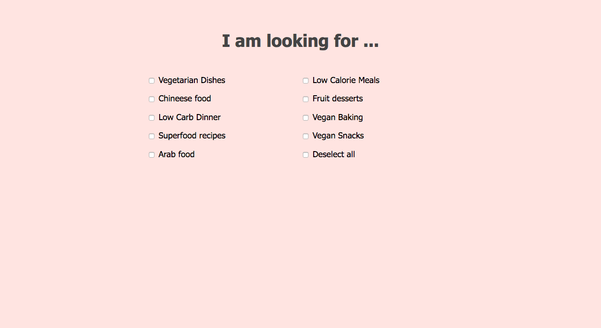
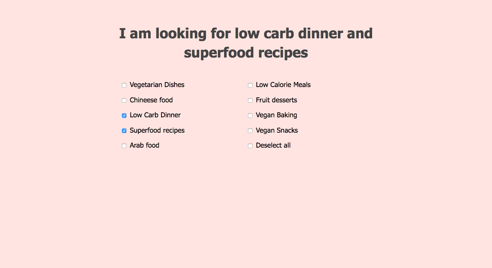
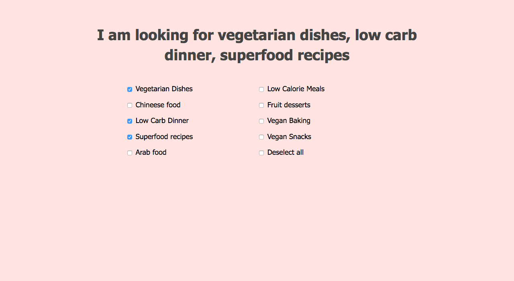

# Selected items

Update the sentence when checkboxes get selected or deselected.

When two are selected connect the selected options with `and`: 

When many are selected, connect the selected options  with `,`: 

On inital load, if a checkbox is selected by default, the sentence should also be correctly displayed.

Extra:

Add toggle to hide or show all checkboxes.

> use jQuery